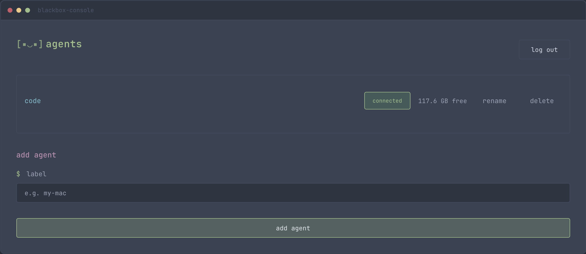
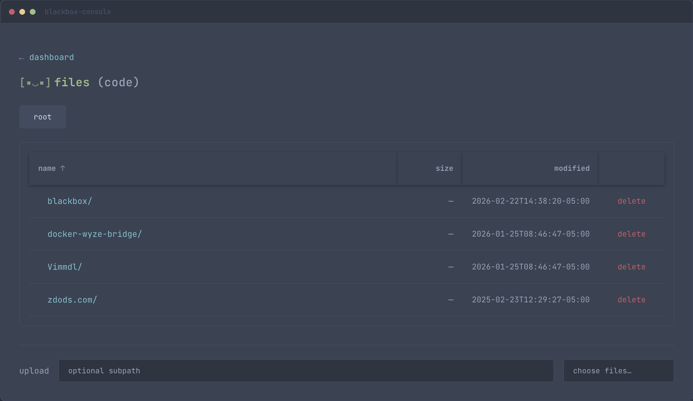

<p align="center"><strong>[▪‿▪]</strong></p>

# blackbox

Self-hosted, single-user cloud storage. Run a server, log in with username/password, and run agents on your machines to expose directories. Browse, upload, and download from one place.

**Requirements:** Go 1.22+, Node 20+ (for building blackbox-console), Docker (optional), Postgres. The agent can be built for Linux, macOS, and Windows.

**Disclaimer:** Provided as-is, no warranty. Not recommended for high-security deployments; use at your own risk.

## Screenshots

**agents dashboard**



**file browser**



The **Agents** view lists agents and connection status; add an agent with a label and the token is copied to your clipboard automatically (or shown if the browser blocks clipboard access). Open an agent to browse **Files**, navigate directories, and upload, download, or delete.

## Quick start

### 1. Run the blackbox-server (Docker)

```bash
docker compose up --build
```

Or use the Makefile / PowerShell script from the repo root:

- **Start once:** `make up` (macOS/Linux) or `.\make.ps1 up` (Windows PowerShell).
- **Hot reload (dev):** `make dev` or `.\make.ps1 dev` — runs `docker compose up --build --watch` so you see container logs and changes under `bastion/`, `web/`, or `pkg/` rebuild the bastion container automatically. Requires Docker Compose v2.22+.
- **Build only:** `make build-bastion` / `.\make.ps1 build-bastion` for the server image; `make build-agent` / `.\make.ps1 build-agent` for the agent binary (outputs `blackbox-agent.exe` on Windows when using make.ps1).

**Windows (PowerShell):** If you get “cannot be loaded because running scripts is disabled”, run once: `Set-ExecutionPolicy -ExecutionPolicy RemoteSigned -Scope CurrentUser`. Or run a single command without changing policy: `powershell -ExecutionPolicy Bypass -File .\make.ps1 dev`.

- **blackbox-console:** http://localhost:8080  
- Register once at http://localhost:8080/register  
- Log in, add an agent (label); the agent token is copied to your clipboard automatically.

For production, set `JWT_SECRET` (e.g. in `.env`). See [.env.example](.env.example).

### 2. Run blackbox-agent (on each host)

The agent runs on **Linux**, **macOS**, and **Windows**. Build the binary for your platform, then run it. Without arguments it starts an interactive setup (bastion URL, directory to serve, then token—paste the token from the console; the token prompt is masked when run in a terminal).

| Platform | Build | Run (interactive) | Example with flags |
|----------|-------|-------------------|--------------------|
| **Linux / macOS** | `go build -o blackbox-agent ./agent` | `./blackbox-agent` | `./blackbox-agent --bastion-url=ws://localhost:8080/ws/agent --token=YOUR_AGENT_TOKEN --hosted-path=/home/you/files` |
| **Windows** | `go build -o blackbox-agent.exe ./agent` | `.\blackbox-agent.exe` | `.\blackbox-agent.exe --bastion-url=ws://localhost:8080/ws/agent --token=YOUR_AGENT_TOKEN --hosted-path=C:\Users\You\files` |

- **Linux / macOS:** Use Unix paths for `--hosted-path` (e.g. `/home/you/files`, `~/files`).
- **Windows:** Use Windows paths for `--hosted-path` (e.g. `C:\Users\You\files`). Build and run from PowerShell or Git Bash; if the server is on the same machine, use `ws://localhost:8080/ws/agent` as the bastion URL.

Keep the agent running; it appears as connected in blackbox-console. Open it to browse and transfer files.

## Local development (no Docker)

For Docker-based development with hot reload, use `make dev` or `.\make.ps1 dev` (see Quick start above).

1. **Postgres** – start Postgres and create a DB (e.g. `brew services start postgresql` on macOS):
   ```bash
   createdb blackbox
   ```

2. **blackbox-console** – build once so the server can serve it:
   ```bash
   cd web && npm install && npm run build && cd ..
   ```

3. **blackbox-server** – from repo root:
   ```bash
   export DATABASE_URL=postgres://postgres@localhost:5432/blackbox?sslmode=disable
   export STATIC_DIR=web/build
   go run ./bastion
   ```

4. **blackbox-agent** – From the repo root, build for your platform (`go build -o blackbox-agent ./agent` on Linux/macOS, `go build -o blackbox-agent.exe ./agent` on Windows), then run the binary and follow the prompts (bastion URL, directory, token), or pass `--bastion-url=ws://localhost:8080/ws/agent`, `--token=...`, and `--hosted-path=...` (Unix path on Linux/macOS, e.g. `~/files`; Windows path on Windows, e.g. `C:\Users\you\files`).

## TLS (production)

To encrypt traffic between server, agents, and browser, run the server with TLS:

```bash
export TLS_CERT_FILE=/path/to/cert.pem
export TLS_KEY_FILE=/path/to/key.pem
go run ./bastion
```

Then use **https://** for the console and **wss://** for agents, e.g. `--bastion-url=wss://your-host:443/ws/agent`. No agent code changes are required—the WebSocket client uses TLS when the URL scheme is `wss://`.

**Connection overhead:** TLS adds one handshake before data flows. Typically that’s **1–2 extra round-trips** on the first connection (~10–50 ms on a good link); resumed sessions often need only **1 extra RTT**. CPU cost is small (modern CPUs do TLS in milliseconds). For long-lived agent connections the overhead is negligible.

## Layout

- `pkg/` – shared message types (agent ↔ server)
- `bastion/` – blackbox-server (auth, agent hub, file-proxy API, serves blackbox-console)
- `agent/` – blackbox-agent binary (WebSocket client, file handlers)
- `web/` – blackbox-console (SvelteKit: login, dashboard, file browser)

## Roadmap

- 2FA (TOTP) for the single user
- Rate limiting and audit log (who accessed which host/path when)
- Clearer error messages and loading states in the UI
- Packaging: macOS (launchd), Linux (systemd), and Windows service/installer for blackbox-agent
- Agent grouping to create volumes (combine multiple agents into one logical volume)
- Further out: sharding files in a volume across agents (distribute file storage across grouped agents)
