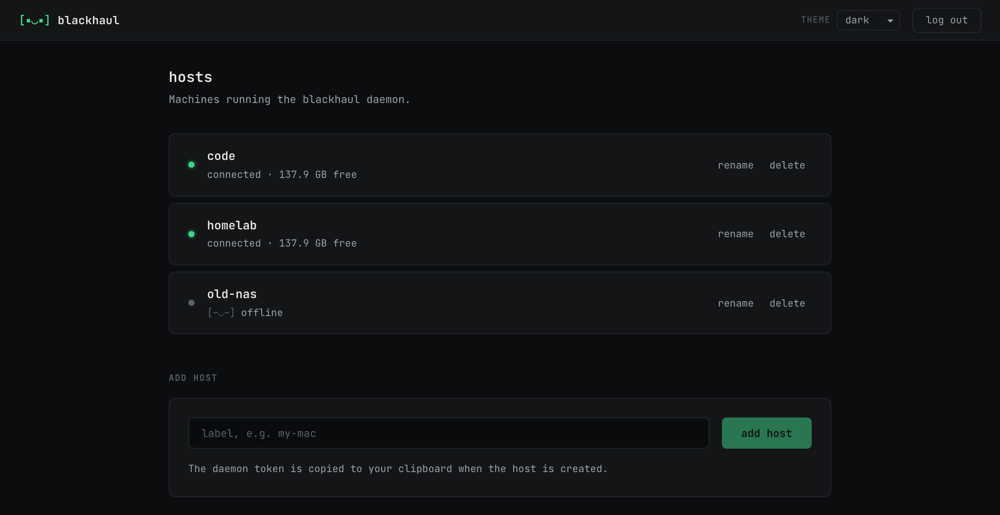
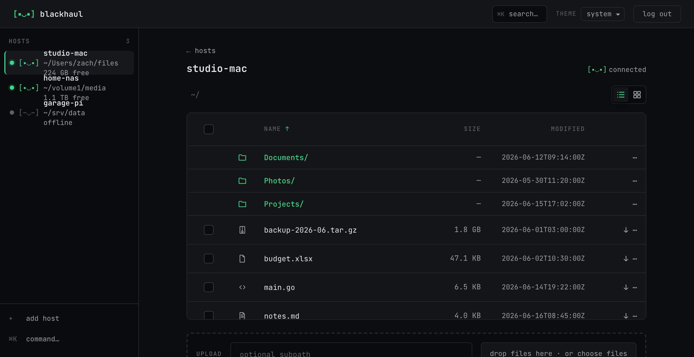

<p align="center"><strong>[▪‿▪]</strong></p>

# blackhaul

[](https://github.com/zdods/blackhaul/actions/workflows/ci.yml)
[](https://github.com/zdods/blackhaul/actions/workflows/deps.yml)
[](https://github.com/zdods/blackhaul/actions/workflows/image.yml)
[](https://github.com/zdods/blackhaul/releases/latest)

Self-hosted, single-user cloud storage. Run a server, sign in with a passkey or username + password (with TOTP two-factor), and run daemons on your machines to expose directories. Browse, upload, and download from one place.

**Requirements:** Go 1.25+, Node 22+ (for building blackhaul-console), Docker (optional), Postgres. The daemon can be built for Linux, macOS, and Windows.

**Disclaimer:** Provided as-is, no warranty. Not recommended for high-security deployments; use at your own risk.

## Screenshots

**hosts dashboard**



**file browser**



The **Hosts** view lists hosts and connection status; add a host with a label and the token is copied to your clipboard automatically (or shown if the browser blocks clipboard access). Open a host to browse **Files**, navigate directories, and upload, download, or delete (including multi-select). An **Account** screen manages your sign-in credentials — add passkeys, change your password, and set an optional email for a [Gravatar](https://gravatar.com) avatar — and a **⌘K command palette** jumps to any host, screen, or action. The console ships with light, dark, and Nord themes (follows your OS by default).

## Quick start

### 1. Run the blackhaul-server (Docker)

```bash
docker compose up
```

This pulls the prebuilt multi-arch image (amd64/arm64) from GHCR — no toolchain needed. Pin a version with `BASTION_IMAGE_TAG=0.1.1` (in `.env` or the environment); images are tagged `X.Y.Z`, `X.Y`, and `latest`, and ship with an SBOM and a signed build-provenance attestation (verify with `gh attestation verify oci://ghcr.io/zdods/blackhaul-bastion:X.Y.Z --owner zdods`).

Or use the Makefile / PowerShell script from the repo root:

- **Start once:** `make up` (macOS/Linux) or `.\make.ps1 up` (Windows PowerShell).
- **Hot reload (dev, builds from source):** `make dev` or `.\make.ps1 dev` — applies the `docker-compose.dev.yml` overlay with `--build --watch` so changes under `bastion/`, `web/`, or `pkg/` rebuild the bastion container automatically. Requires Docker Compose v2.22+.
- **Build only:** `make build-bastion` / `.\make.ps1 build-bastion` for the server image; `make build-daemon` / `.\make.ps1 build-daemon` for the daemon binary (outputs `blackhaul-daemon.exe` on Windows when using make.ps1).

**Windows (PowerShell):** If you get "cannot be loaded because running scripts is disabled", run once: `Set-ExecutionPolicy -ExecutionPolicy RemoteSigned -Scope CurrentUser`. Or run a single command without changing policy: `powershell -ExecutionPolicy Bypass -File .\make.ps1 dev`.

- **blackhaul-console:** http://localhost:8080  
- Register once at http://localhost:8080/register  
- Log in, add a host (label); the daemon token is copied to your clipboard automatically.

For production, set `JWT_SECRET` (e.g. in `.env`; generate one with `openssl rand -base64 32`, **at least 32 bytes** or the server refuses to start). If unset, the server generates a random ephemeral secret at startup — secure by default, but all sessions reset on restart. Set `TOTP_ENC_KEY` to encrypt 2FA secrets at rest with a dedicated key, and `COOKIE_SECURE=1` when TLS terminates at a reverse proxy. Ports, Postgres credentials, and other options can be overridden via environment variables; see [.env.example](.env.example).

By default, sign-in is username + password + TOTP. To enable **passkeys** (WebAuthn), set `AUTH_MODE=passkey` (usernameless passkey login) or `AUTH_MODE=both` (passkey **and** password shown side by side) along with `RP_ID` (your domain) and `RP_ORIGINS`. Passkey enrollment works in every mode from the **Account** screen, so you can add one while in password mode and switch later. See [.env.example](.env.example) and [docs/deployment.md](docs/deployment.md) for the full passkey configuration.

### 2. Run blackhaul-daemon (on each host)

The daemon runs on **Linux**, **macOS**, and **Windows**. Install a prebuilt binary (no Go toolchain needed) — pick whichever fits the host.

**Homebrew (macOS & Linux)** — the simplest path; `brew` handles upgrades and removal:

```bash
brew install zdods/tap/blackhaul-daemon
```

**Install script (macOS & Linux)** — detects your OS/arch, verifies the release checksum, and installs to `/usr/local/bin`:

```bash
curl -fsSL https://raw.githubusercontent.com/zdods/blackhaul/main/install.sh | sh
```

Override the location with `BLACKHAUL_INSTALL_DIR`, or pin a version with `BLACKHAUL_VERSION=vX.Y.Z`.

**Windows** — download the zip from the [latest release](https://github.com/zdods/blackhaul/releases/latest) and follow [packaging/windows/README.md](packaging/windows/README.md).

**From source** (needs the Go toolchain):

| Platform | Build | Run |
|----------|-------|-----|
| **Linux / macOS** | `go build -o blackhaul-daemon ./daemon` | `./blackhaul-daemon` |
| **Windows** | `go build -o blackhaul-daemon.exe ./daemon` | `.\blackhaul-daemon.exe` |

Verify the install with `blackhaul-daemon --version`.

Without arguments the daemon starts an interactive setup (bastion URL, directory to serve, token). At the end it offers to save those values to a config file (`~/.blackhaul-daemon` on Linux/macOS, `%USERPROFILE%\.blackhaul-daemon` on Windows, permissions `0600`). On subsequent runs it reads the config automatically — no prompts needed.

You can also supply values directly without going through setup:

```bash
# Flags (highest priority)
./blackhaul-daemon --bastion-url=ws://localhost:8080/ws/daemon --token=YOUR_TOKEN --hosted-path=~/files

# Environment variables (useful for containers and service files)
BLACKHAUL_BASTION_URL=ws://localhost:8080/ws/daemon \
BLACKHAUL_TOKEN=YOUR_TOKEN \
BLACKHAUL_HOSTED_PATH=~/files \
./blackhaul-daemon

# Alternate config file path
./blackhaul-daemon --config=/etc/blackhaul/daemon.conf
```

Priority order: **flags > env vars > config file > interactive prompts**.

Keep the daemon running; it appears as connected in blackhaul-console. Open it to browse and transfer files.

## Running blackhaul-daemon as a service

After running the daemon interactively once and saving its config (it will prompt you), install it as a persistent service so it starts automatically.

### Linux (systemd)

```bash
sudo cp packaging/systemd/blackhaul-daemon.service /etc/systemd/system/
# Edit the file and replace "yourusername" with your actual username
sudo systemctl daemon-reload
sudo systemctl enable --now blackhaul-daemon
# Check status
sudo systemctl status blackhaul-daemon
journalctl -u blackhaul-daemon -f
```

The config lives at `~/.blackhaul-daemon` (owner-read-only, `0600`).

### macOS (launchd)

```bash
# Edit packaging/launchd/io.github.blackhaul.daemon.plist and replace "yourusername"
cp packaging/launchd/io.github.blackhaul.daemon.plist ~/Library/LaunchAgents/
launchctl load ~/Library/LaunchAgents/io.github.blackhaul.daemon.plist
# Check status
launchctl list | grep blackhaul
tail -f ~/Library/Logs/blackhaul-daemon.log
```

The config lives at `~/.blackhaul-daemon` (owner-read-only, `0600`).

### Windows

See [`packaging/windows/README.md`](packaging/windows/README.md) for NSSM (recommended) and `sc.exe` instructions.

The config lives at `%USERPROFILE%\.blackhaul-daemon` (e.g. `C:\Users\You\.blackhaul-daemon`).

## Updating & uninstalling

**Homebrew:** `brew upgrade blackhaul-daemon` to update. To remove, clear the stored token + config first (so nothing is orphaned), then uninstall:

```bash
blackhaul-daemon --reset && brew uninstall blackhaul-daemon
```

**Install script:** re-run the install one-liner to update. To remove everything — the launchd/systemd service, the stored token + config, and the binary — run:

```bash
curl -fsSL https://raw.githubusercontent.com/zdods/blackhaul/main/install.sh | sh -s -- --uninstall
```

To clear only the stored credentials without removing the binary, run `blackhaul-daemon --reset`. To fully revoke access, also delete the host in the blackhaul console.

---

## Local development (no Docker)

For Docker-based development with hot reload, use `make dev` or `.\make.ps1 dev` (see Quick start above).

1. **Postgres** – start Postgres and create a DB (e.g. `brew services start postgresql` on macOS):
   ```bash
   createdb blackhaul
   ```

2. **blackhaul-console** – build once so the server can serve it:
   ```bash
   cd web && npm install && npm run build && cd ..
   ```

3. **blackhaul-server** – from repo root:
   ```bash
   export DATABASE_URL=postgres://postgres@localhost:5432/blackhaul?sslmode=disable
   export STATIC_DIR=web/build
   go run ./bastion
   ```

4. **blackhaul-daemon** – Build and run:
   ```bash
   go build -o blackhaul-daemon ./daemon
   ./blackhaul-daemon
   ```
   Follow the prompts (bastion URL, directory, token) and choose **y** to save the config to `~/.blackhaul-daemon`. On subsequent runs the daemon starts without prompts.

## TLS (production)

To encrypt traffic between server, daemons, and browser, run the server with TLS:

```bash
export TLS_CERT_FILE=/path/to/cert.pem
export TLS_KEY_FILE=/path/to/key.pem
go run ./bastion
```

Then use **https://** for the console and **wss://** for daemons, e.g. `--bastion-url=wss://your-host:443/ws/daemon`. No daemon code changes are required—the WebSocket client uses TLS when the URL scheme is `wss://`.

**Connection overhead:** TLS adds one handshake before data flows. Typically that's **1–2 extra round-trips** on the first connection (~10–50 ms on a good link); resumed sessions often need only **1 extra RTT**. CPU cost is small (modern CPUs do TLS in milliseconds). For long-lived daemon connections the overhead is negligible.

## Documentation

- [Architecture](docs/architecture.md) — components, the daemon↔bastion protocol, data model, and security boundaries
- [FAQ & troubleshooting](docs/faq.md) — "is my data safe?", connection problems, common errors
- [Deploying behind a reverse proxy (TLS)](docs/deployment.md) — nginx / Caddy / Traefik WebSocket config
- [Security policy](SECURITY.md) — reporting vulnerabilities; [internal security notes](docs/security-notes.md)

## Layout

- `pkg/` – shared message types (daemon ↔ server)
- `bastion/` – blackhaul-server (auth, daemon hub, file-proxy API, serves blackhaul-console)
- `daemon/` – blackhaul-daemon binary (WebSocket client, file handlers)
- `web/` – blackhaul-console (SvelteKit: login, dashboard, file browser)

## Roadmap

- [ ] **Share links** — time-limited public download links, proxied through the bastion
- [ ] Folder upload (entire directory trees)
- [ ] Rename/move files and directories; create directories
- [ ] File search across hosted directories
- [ ] Live daemon status via WebSocket push instead of polling
- [ ] Volumes — group multiple daemons into one logical volume, with files sharded across them

Have a feature you want? [Open a feature request](https://github.com/zdods/blackhaul/issues/new?template=feature_request.yml).

## License

[MIT](LICENSE)
