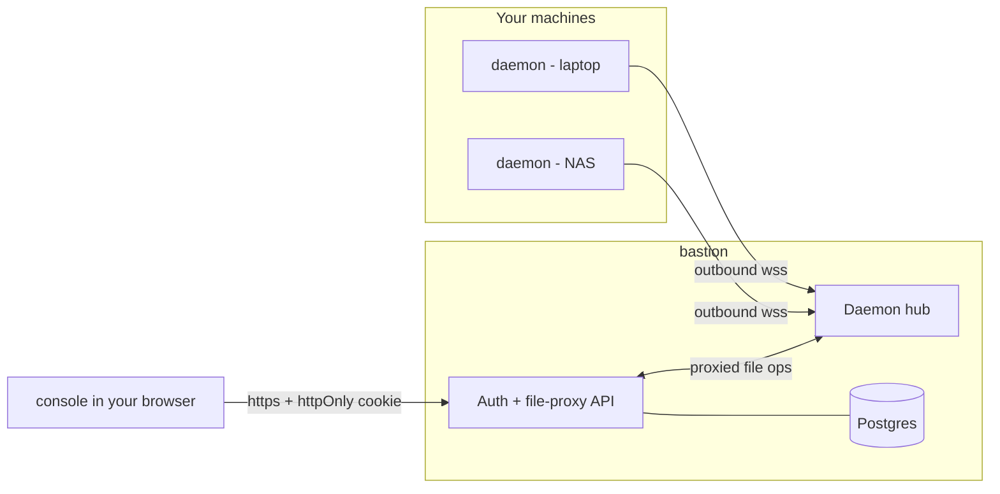

# Architecture

blackhaul is self-hosted, single-user cloud storage. It has three parts:

- **bastion** — the Go server. Handles auth, runs the daemon hub, exposes the
  file-proxy API, and serves the console. Stores no file content.
- **daemon** — a small Go binary you run on each machine whose files you want to
  reach. It dials **outbound** to the bastion and serves file operations scoped
  to one directory.
- **console** — the SvelteKit web UI (static assets, built into the bastion
  image and served by it).



The defining property: **daemons connect outbound and the bastion never stores
file bytes.** Your machines need no inbound ports, and the server is a relay,
not a storage tier.

## Ports and surfaces

The bastion listens on one port (default `:8080`) and multiplexes:

| Path | Purpose |
|------|---------|
| `/{path...}` | the console (static files) |
| `/api/*` | JSON API (auth, daemon registry, file proxy) |
| `/ws/daemon` | daemon WebSocket endpoint |
| `/healthz` | liveness + DB ping (also the Docker healthcheck) |

For TLS, terminate at a reverse proxy in front of the bastion and have daemons
dial `wss://`. See [deployment.md](deployment.md).

## Auth and sessions (the console user)

There is exactly one user account. Registration is a one-time setup
(`GET /api/setup` reports whether a user exists and which sign-in methods are
offered; the `/register` flow is gated on there being none).

`AUTH_MODE` selects the sign-in methods: `password` (the default), `passkey`,
or `both`. Either factor yields the **same session** — a JWT in an httpOnly
cookie.

- **Password + TOTP.** The password is hashed with **bcrypt**; **TOTP (2FA) is
  mandatory** for password accounts and enrolled during registration. Login is
  two steps: `POST /api/login` (password) then `POST /api/login/totp` (code).
- **Passkeys (WebAuthn).** When `AUTH_MODE` is `passkey`/`both` and a relying
  party is configured (`RP_ID`, `RP_ORIGINS`), the bastion runs WebAuthn
  ceremonies (`/api/passkey/login/*`, `/api/passkey/register/*`) via
  [`go-webauthn`](https://github.com/go-webauthn/webauthn); login is
  usernameless (discoverable credentials, user verification required).
  Credentials live in `webauthn_credentials`. Passkey enrollment and management
  (`/api/passkeys*`) are available in **every** mode, so a password account can
  add a passkey and then switch modes; the last credential that's the only way
  in can't be removed.
- On success the bastion issues a **JWT carried only in an httpOnly cookie** —
  never in a response body, never in localStorage.
- Each JWT embeds the user's `token_version`. Logout bumps `token_version`,
  which **revokes every outstanding session** at once; changing the password
  bumps it too (re-issuing the current session). Every authenticated request
  re-checks it.
- The **Account** screen (`/api/account`, `/api/account/password`) manages the
  profile email, password change/set, and passkeys.
- Abuse controls: auth endpoints are rate-limited (10/min per IP); TOTP locks
  for 15 minutes after 5 failed codes. Behind a reverse proxy, set
  `TRUST_PROXY=1` so the limiter keys on `X-Forwarded-For`.

## Daemon enrollment and connection

Enrollment is admin-driven (no pending-approval queue):

1. In the console, add a host with a label. The bastion creates a daemon row
   with a random **token** and returns it once (copied to your clipboard).
2. You install the daemon on the host and give it the bastion URL, the token,
   and a **hosted path** — the single root directory it will expose.
3. The daemon dials `wss://…/ws/daemon` and authenticates.

The connection handshake over the WebSocket:

```
daemon → bastion   {"type":"auth","token":"<token>"}
bastion            looks up the daemon by SHA-256(token)
bastion → daemon   {"type":"auth_ok","daemon_id":"<uuid>"}      (or auth_error)
```

Tokens are stored **hashed** (SHA-256) at rest — the plaintext exists only on
the host's daemon config (`~/.blackhaul-daemon`, mode `0600`). After a
successful auth the bastion registers the live connection in an **in-memory
hub** keyed by daemon id. (The hub and TOTP setup cache are in-memory, so a
bastion runs as a single replica — which is exactly the per-instance model.)

## The file-proxy protocol

When the console requests a file operation, the bastion looks up the target
daemon's live connection and proxies the operation over the WebSocket. Requests
are **multiplexed**: every request carries a `request_id`, and the bastion
matches each response frame back to its waiter, so many operations share one
connection concurrently.

Message types (defined in [`pkg/message.go`](../pkg/message.go)):

| Type | Direction | Purpose |
|------|-----------|---------|
| `auth` / `auth_ok` / `auth_error` | handshake | daemon authentication |
| `list_dir` | bastion → daemon | directory listing |
| `get_meta` | bastion → daemon | size / mtime / is_dir |
| `get_disk` | bastion → daemon | free/total bytes of the hosted volume |
| `read_file` | bastion → daemon | read a small file (base64 in JSON) |
| `write_file` | bastion → daemon | write a small file (base64 in JSON) |
| `delete_file` | bastion → daemon | delete |
| `read_chunk` | bastion → daemon | read a byte range — JSON reply **+ binary frame** |
| `write_chunk` | bastion → daemon | write one chunk — JSON control **+ binary frame** |

Small messages are plain JSON. Bulk transfers use a **two-frame pattern**: a
JSON control frame followed by a raw binary WebSocket frame carrying the bytes.
This keeps large files off the (base64, ~1.33×) JSON path.

### Downloads

1. Bastion asks the daemon for `get_meta` to learn the size.
2. **Small files (≤ 5 MB):** a single `read_file` (base64), decoded and written
   to the HTTP response.
3. **Large files:** the bastion loops `read_chunk` (5 MB at a time); each reply
   is a JSON control frame plus a binary data frame, which the bastion writes to
   the HTTP response and **flushes** as it goes.
4. The console triggers the download via a navigation (the httpOnly cookie rides
   along) so the **browser streams to disk** instead of buffering a Blob in tab
   memory. The bastion sends a `Content-Disposition` filename.

### Uploads

1. The console splits the file at **5 MB**. Files ≤ 5 MB take a single
   `PUT …/files` → `write_file`.
2. Larger files upload chunk-by-chunk: each chunk is a
   `PUT …/files?upload_id=…&chunk_index=…&total_chunks=…` → `write_chunk`
   (JSON control + binary frame).
3. The daemon writes each chunk to a temp directory under the hosted root and,
   once all chunks arrive, assembles them into the final file (reading one chunk
   at a time). Stale partial uploads are garbage-collected after 10 minutes.
4. The bastion caps each request body at **6 MB** (`413` otherwise) and limits
   concurrent transfers, so a single request can never buffer a large body in
   RAM. See the [v0.5.0 changelog](../CHANGELOG.md) for the memory model.

### Path scoping

Every path in a request is **relative to the daemon's hosted path**. The daemon
resolves and rejects traversal outside that root (`../…`), so a compromised or
malicious bastion still cannot reach beyond the directory you chose to expose.

## Persistence

Postgres holds only account and registration data — **no file content and no
file listings**. Migrations run on boot via a small `schema_migrations` runner
(one transaction per migration).

| Table | Columns |
|-------|---------|
| `users` | `id`, `username`, `email`, `password_hash` (nullable for passkey-only accounts), `totp_secret`, `token_version`, `created_at` |
| `webauthn_credentials` | `id`, `user_id`, `credential_id`, `public_key`, `sign_count`, `transports`, `name`, `created_at`, `last_used_at` — one row per enrolled passkey |
| `daemons` | `id`, `label`, `token_hash`, `hosted_path`, `created_at` |

Because the database is tiny and content-free, backups are cheap and contain no
user files.

## Configuration

The bastion is configured entirely via environment variables (see
[`.env.example`](../.env.example)):

| Var | Meaning |
|-----|---------|
| `DATABASE_URL` | Postgres connection string |
| `SERVER_ADDR` | listen address (default `:8080`) |
| `JWT_SECRET` | session signing key; if unset, an **ephemeral** random key is generated (secure, but sessions reset on restart). An explicit value must be **≥32 bytes** |
| `TOTP_ENC_KEY` | base64 of 32 bytes used to encrypt TOTP secrets at rest; if unset, a key is derived from a stable `JWT_SECRET` |
| `AUTH_MODE` | sign-in methods offered: `password` (default), `passkey`, or `both`. `passkey` requires `RP_ID`; `both` degrades to password-only if `RP_ID` is unset |
| `RP_ID` / `RP_ORIGINS` / `RP_DISPLAY_NAME` | WebAuthn relying-party config for passkeys: registrable domain (no scheme/port), comma-separated allowed origins (default `https://<RP_ID>`), and the name authenticators show |
| `STATIC_DIR` | directory to serve the console from |
| `TLS_CERT_FILE` / `TLS_KEY_FILE` | terminate TLS in-process instead of at a proxy |
| `COOKIE_SECURE` | force the `Secure` flag on the session cookie (TLS at a proxy) |
| `CORS_ORIGIN` | allowed cross-origin; headers are emitted only for a matching `Origin` |
| `TRUST_PROXY` | trust the right-most `X-Forwarded-For` hop for client IPs (set only behind a proxy) |
| `DEV_MODE` | use the well-known dev JWT secret (local only) |
| `LOG_FORMAT` / `LOG_LEVEL` | `json` logs; `debug` includes static-asset access logs |

## Security boundaries (summary)

- **No inbound ports on your hosts** — daemons dial out.
- **No file content at rest on the server** — the bastion proxies bytes; it
  never writes them to disk or the database.
- **Single user; strong auth, httpOnly-cookie sessions, revocable in bulk.**
  Password accounts require TOTP (2FA); passkey accounts authenticate with
  phishing-resistant WebAuthn (user verification). TOTP secrets are encrypted at
  rest; sessions get a same-origin (CSRF) check.
- **Daemon tokens hashed at rest;** plaintext lives only in the host's `0600`
  config.
- **Symlink-safe path containment at the daemon**, scoped to one hosted
  directory; daemons are scoped to their owning user.
- **Defensive HTTP**: nosniff / `X-Frame-Options` / CSP, `octet-stream`
  downloads, and size-capped daemon WebSocket frames.

For the threat model and reporting process, see [SECURITY.md](../SECURITY.md)
and [security-notes.md](security-notes.md).
